# Automate AWS Resource Creation with Bash

This project automates the creation of an EC2 instance, a security group, and an S3 bucket using Bash and the AWS CLI, following least privilege and security best practices throughout.

## Table of Contents

- [Overview](#overview)
- [Architecture](#architecture)
- [Prerequisites](#prerequisites)
- [Setup](#setup)
  - [Region choice](#region-choice)
  - [IAM policy](#iam-policy)
- [Scripts](#scripts)
  - [create_ec2.sh](#create_ec2sh)
  - [create_security_group.sh](#create_security_groupsh)
  - [create_s3_bucket.sh](#create_s3_bucketsh)
  - [cleanup_resources.sh](#cleanup_resourcessh)
- [Additional Scripts](#additional-scripts)
  - [update_security_group.sh](#update_security_groupsh)
  - [run_all.sh](#run_allsh)
- [State Management](#state-management)
- [Security Summary](#security-summary)
- [.gitignore](#gitignore)
- [Known Limitations](#known-limitations)

## Overview

The goal of this project is to stand up a small, repeatable AWS environment using nothing but Bash and the AWS CLI: an EC2 instance, a security group, and an S3 bucket, provisioned the same way every time and safe to run more than once.

Four scripts cover the core requirements:

- `create_ec2.sh` creates a key pair and launches an EC2 instance
- `create_security_group.sh` creates a security group scoped to SSH and HTTP
- `create_s3_bucket.sh` creates a versioned, encrypted S3 bucket
- `cleanup_resources.sh` removes everything the other scripts created

Two more scripts, `update_security_group.sh` and `run_all.sh`, were added along the way and are described at the end of this document.

Every script is idempotent, meaning running it twice does not create duplicate resources. Resource IDs are shared between scripts through a `.lab-state` folder rather than being hardcoded or copied around manually.

## Architecture

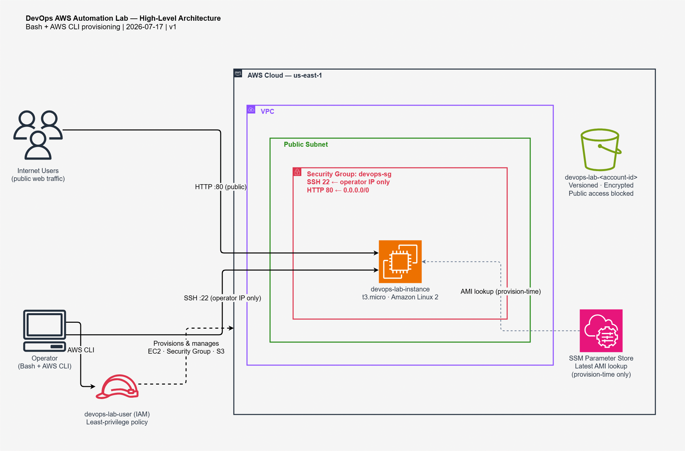


## Prerequisites

- AWS CLI v2 installed (`aws --version` to check)
- An IAM user with the least privilege policy described below, configured as a named profile called `devops-lab`
- `jq` installed (`sudo apt install jq`), used by `cleanup_resources.sh`
- Bash on Linux, macOS, or WSL

## Setup

### Region choice

Scripts default to `us-east-1`. `af-south-1` (Cape Town) was also considered, since it is geographically closer to Rwanda, but it is an opt-in region that needs to be manually enabled, and its Free Tier coverage has been less consistent than long standing regions. `us-east-1` was chosen for its default availability and reliable Free Tier support.

### IAM policy

A custom least privilege policy was used instead of broad managed policies like `AmazonEC2FullAccess`. It scopes EC2 actions to `us-east-1` and S3 actions to bucket names prefixed with `devops-lab-`. The policy was expanded a few times while testing, as specific actions turned out to be needed; those additions are noted in the relevant script sections below.

Create the policy in IAM Console under Policies, attach it to a dedicated IAM user (`devops-lab-user`), and configure the CLI with:

```bash
aws configure --profile devops-lab
```

Use region `us-east-1` and output format `json`.

## Scripts

### create_ec2.sh

Creates an EC2 key pair if one does not already exist, then launches an instance using the latest Amazon Linux 2 AMI. Prints the instance ID, public IP, and an SSH command, and saves the instance ID to `.lab-state/instance_id.txt`.

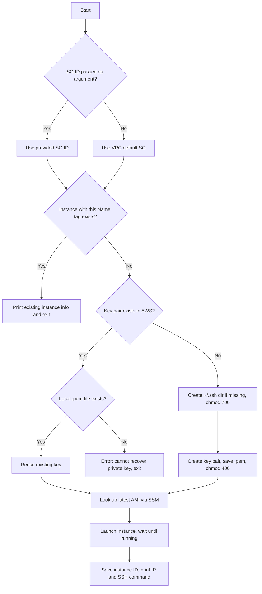

**Usage**

```bash
./create_ec2.sh                        # falls back to the VPC's default security group
./create_ec2.sh sg-0ce9c0aa0a34bbd7f    # use a specific security group
```

**Key decisions**

AMI IDs change over time and differ by region, so the script looks up the latest Amazon Linux 2 AMI at runtime through AWS's public SSM parameter instead of hardcoding one. The private key is saved to `~/.ssh/` rather than the project folder, and locked to `chmod 400`, keeping it out of version control by default.

Two issues came up during testing. `~/.ssh` did not exist yet on a fresh WSL setup, so the script now creates it with the right permissions before writing the key into it. And `t2.micro` was rejected as not Free Tier eligible, since AWS changed its Free Tier instance types for accounts created after mid-2025; `t3.micro` is used instead.

**Screenshot**

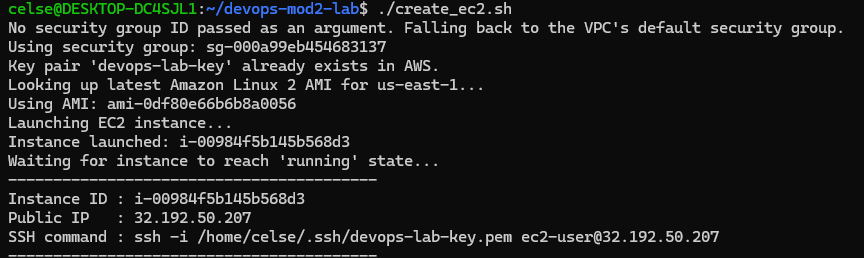

### create_security_group.sh

Creates a security group that allows SSH from the caller's current public IP and HTTP from anywhere. Saves the resulting security group ID to `.lab-state/sg_id.txt`.

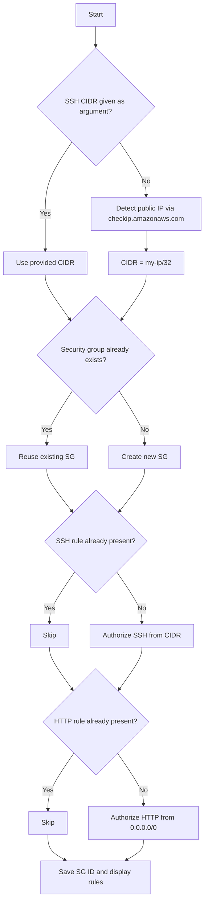

**Usage**

```bash
./create_security_group.sh            # auto-detects your public IP for SSH
./create_security_group.sh 0.0.0.0/0  # explicitly open SSH to everyone, not recommended
```

**Key decisions**

SSH could be opened to `0.0.0.0/0`, but was restricted instead to the caller's own IP as a `/32`, detected automatically through `checkip.amazonaws.com`. HTTP was left open, since it is meant to be reachable by anyone viewing the site rather than just the operator. A rule-existence check was added so the script can be re-run without erroring on a duplicate rule.

**Screenshot**

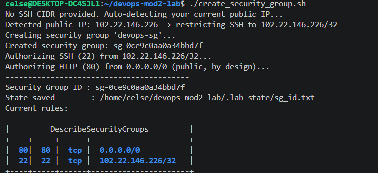

### create_s3_bucket.sh

Creates a uniquely named, versioned S3 bucket with public access blocked, default encryption enabled, and a policy denying non-HTTPS requests. Uploads a sample `welcome.txt` file and saves the bucket name to `.lab-state/bucket_name.txt`.

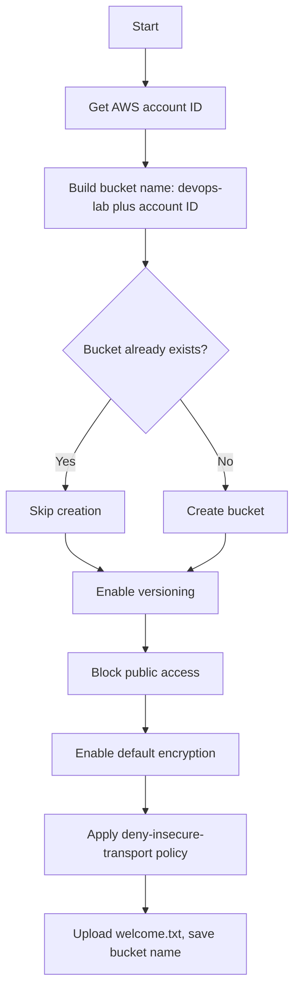

**Usage**

```bash
./create_s3_bucket.sh
```

**Key decisions**

Bucket names must be unique across all of AWS, so the name is built from the account ID rather than a random suffix, keeping it both unique and consistent across runs. A public-read bucket policy was considered, since that is a common approach, but a policy denying non-HTTPS requests was used instead so the bucket's contents are not exposed. `us-east-1` is also the one region where `--create-bucket-configuration` needs to be left out rather than set.

**Screenshot**

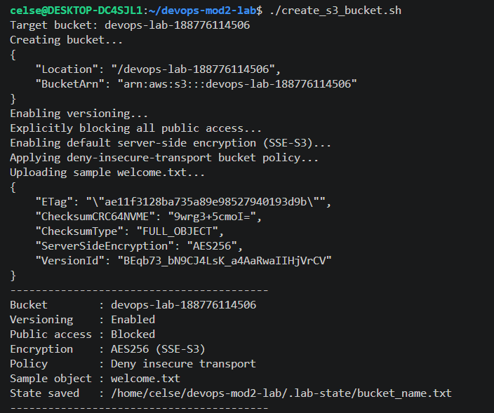

### cleanup_resources.sh

Removes the EC2 instance, key pair, security group, and S3 bucket created by the other scripts, reading their IDs from `.lab-state/`. This is the only script that makes irreversible changes, so it asks for a confirmation phrase before doing anything.

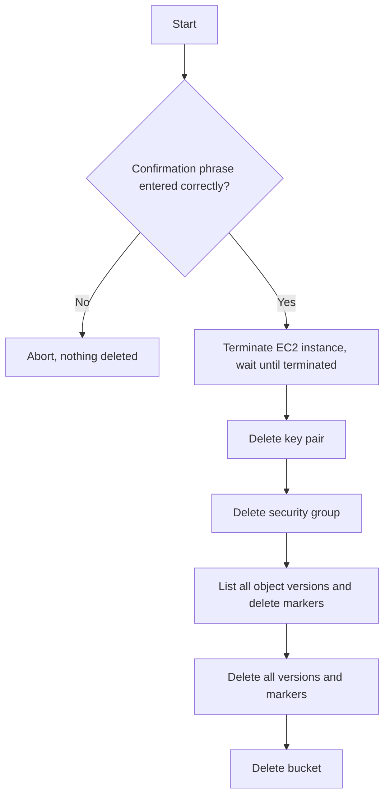

**Usage**

```bash
./cleanup_resources.sh
```

**Key decisions**

Resources are deleted in dependency order, since the instance has to finish terminating before its security group can be removed. Versioning, enabled by `create_s3_bucket.sh`, means deleted objects leave a delete marker behind rather than disappearing, so the script clears both object versions and delete markers before deleting the bucket itself. The local `.pem` file is left in place even after the AWS side key pair is deleted, since removing it felt like a separate decision from tearing down cloud resources.

**Screenshot**

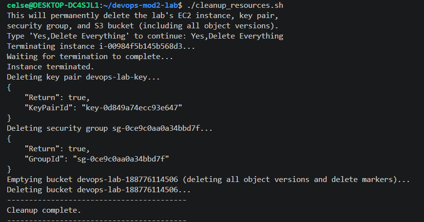

## Additional Scripts

These two scripts were not part of the original requirements. They came up naturally while testing the four scripts above and are kept here for completeness.

### update_security_group.sh

A small utility used to attach a security group to an instance that was already running before its intended security group existed. Reads both IDs from `.lab-state/`.

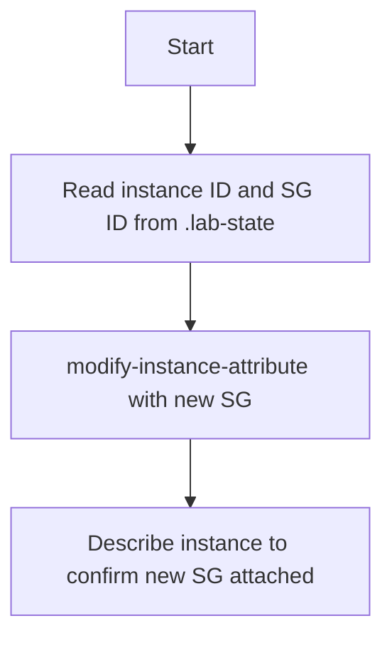

**Usage**

```bash
./update_security_group.sh
```

**Key decisions**

`modify-instance-attribute --groups` replaces an instance's entire security group list rather than adding to it, which is what this script relies on. It hit an `UnauthorizedOperation` on `ec2:ModifyInstanceAttribute` during testing, a permission not covered by anything already granted for launching or terminating instances, and was added to the IAM policy once discovered.

#### screeenshot


### run_all.sh

Runs the three provisioning scripts in order: security group, then EC2 instance, then S3 bucket.

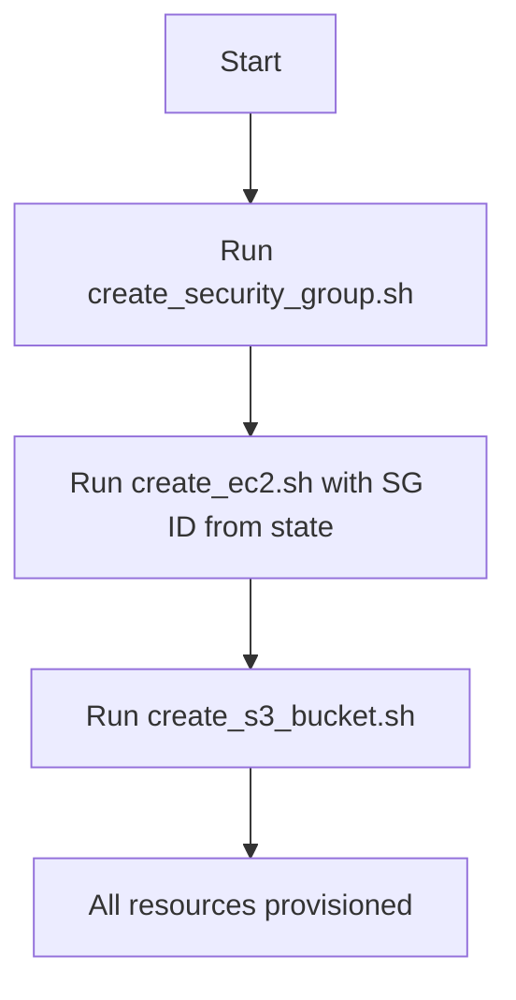

**Usage**

```bash
./run_all.sh
```

**Key decisions**

This script does not add new logic of its own. It calls the existing scripts in the order they depend on each other. Since each one already handles its own errors and idempotency, no extra handling was needed here.

## State Management

The `.lab-state` folder holds small text files written by each script as it creates resources, removing the need to copy IDs between commands by hand. It is excluded from version control, since it contains account specific resource IDs.

## Security Summary

- IAM policy follows least privilege, scoped to specific actions, a specific region for EC2, and specific bucket name prefixes for S3.
- SSH access is restricted to the operator's current public IP by default.
- S3 bucket has public access blocked, versioning enabled, default encryption, and a policy denying non-HTTPS requests.
- No long lived secrets are stored in the repository. The private key lives in `~/.ssh/` with `400` permissions, and `.lab-state/` is git ignored.

## .gitignore

```
.lab-state/
*.pem
```

## Known Limitations

- The IAM policy is scoped to `us-east-1`. Running in a different region requires updating the policy's region condition first.
- `create_ec2.sh` falls back to the VPC's default security group if none is provided, which does not allow inbound SSH from outside the VPC. Use `create_security_group.sh` first, or `run_all.sh`, for a properly configured instance.
- `cleanup_resources.sh` assumes resource names match the create scripts' defaults. Update the script's variables if you customized names manually.